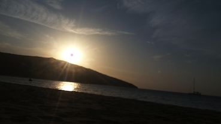

Some quotes I want to share.  
Not all of these are to be taken serious. I don't fully endorse, believe in, or live by the content of each quote (but some of them), I just find them worth to collect and share. Some are statements made by famous people, others I found in random places on the internet. (Attribution added where I am certain.)

.
>"The possible has been tried and failed. Now it’s time to try the impossible." - [Sun Ra](https://en.wikipedia.org/wiki/Sun_Ra)
.
>"It’s a responsibility to be as open as you possibly can to the world as an aesthetic object" - [Zadie Smith](https://en.wikipedia.org/wiki/Zadie_Smith)
.
>"Power concedes nothing without a demand. It never has and it never will." - [Frederick Douglass](https://en.wikipedia.org/wiki/Frederick_Douglass)
.
>"Scientific knowledge is a body of statements of varying degrees of certainty - some most unsure, some nearly sure, none absolutely certain." - [Richard Feynman](https://en.wikipedia.org/wiki/Richard_Feynman)
.
>"It's not about the number of hours you practice, it's about the number of hours your mind is present during the practice." - [Kobe Bryant](https://en.wikipedia.org/wiki/Kobe_Bryant)
.
>"The truth is that as a man’s real power grows and his knowledge widens, ever the way he can follow grows narrower: until at last he chooses nothing, but does only and wholly what he must do." - [Ursula K. Le Guin](https://en.wikipedia.org/wiki/Ursula_K._Le_Guin)
.
>"When a man strays from the right path, a kind man needs the courage to raise his fist and correct him." - [Jamil Neate](https://gundam.fandom.com/wiki/Jamil_Neate)
.
>"Life has many doors Ed-boy" - [Rolf](https://ed.fandom.com/wiki/Rolf)
.
>"Could I interest you in everything all of the time?" - [Bo Burnham](https://www.youtube.com/watch?v=8NJDMV9hJxc)
.
>"The evolution of the idea of money is closely associated, for reasons which must be apparent to even the most casual observer, with the development of the notions of sin and guilt. Even in the earliest periods of trade we find rudimentary principles at work such as would lead us to believe that primitive man had evolved methods of exchange which sui generis implied the existence of debt. It was not until Ricardo’s time, however, that a formula was arrived at which expressed the relationship between debtor and creditor beyond all caviling. With almost Euclidian simplicity Ricardo summed it up thus: "a debt is discharged by the delivery of money." The realization that we collectively have no idea what we're doing here, that a whole lot of what we believe to be real and permanent is imaginary and temporary, and that there are no rules to life, no winners, that we should take care of nature and each other, and that you should follow your muse to do what you find interesting and beautiful." - [Henry Miller](https://en.wikipedia.org/wiki/Henry_Miller)
.
>"No plan survives first contact with the enemy" - Moltke.  
.
>"Don’t do anything in extremes, including not doing anything in extremes."
.
>"There are bold X, and old X, but no old, bold X. Replace X with any practitioners subject to sufficient risk as a result of their practice."
.
>"You will be fooled by a trick if it involves more time, money and practice than you (or any other sane onlooker) would be willing to invest."
.
>"Although the bag on the oxygen mask may not inflate, oxygen is flowing."
.
>"Some people thrive on adversity and struggle; I'm not one of them, and I believe [...] adversity and struggle come anyway, there's no need to seek them out."
.
>"The software isn’t finished until the last user is dead."
.
>"Teach a man to fish, and you reduce the chances of maintaining a sustainable ecosystem."
.
>"Truth is dead. There is only output."
.
>"Don’t hate the media. Be the media."
